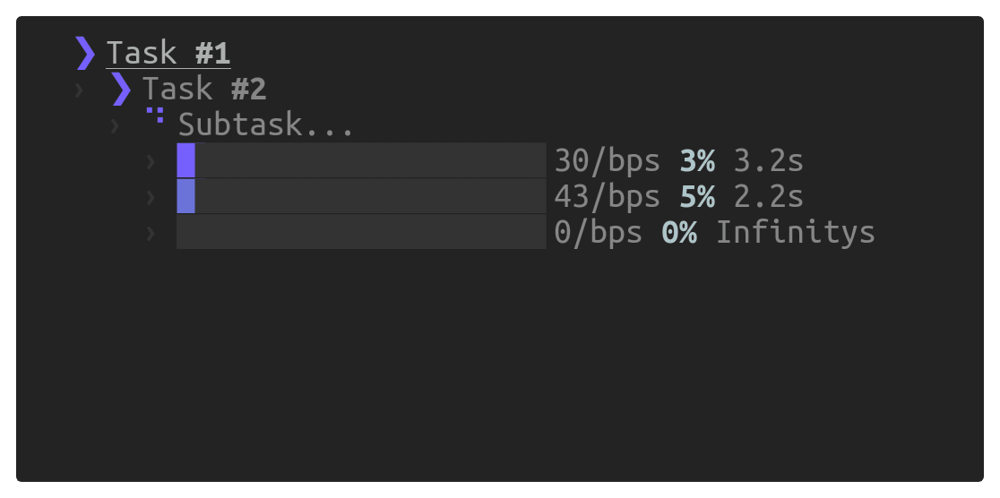

<p align="center"></p>

<p align="center">
  <a href="https://travis-ci.org/keindev/tasktree"></a>
  <a href="https://codecov.io/gh/keindev/tasktree"></a>
</p>

<h1 align="center">TaskTree</h1>

Simple terminal task tree



## Install

```
$ npm install tasktree-cli --save-dev

OR

$ yarn add tasktree-cli --dev
```

## Usage

```javascript
const TaskTree = require('tasktree-cli').default;
const tree = TaskTree.tree();

// start task tree log update in terminal
tree.start(true);

const task1 = tree.add('New task #1, level #1');
const task2 = tree.add('New task #2, level #2');
const task3 = task2.add('Another task...');

// ... whatever
let promise = new Promise((resolve, reject) => {
    setTimeout(() => {
        resolve('Warning');
    }, 2000);
});

promise.then(result => {
    // Skip task
    task3.skip('and it skipped');
    // Log info message in task2 & complete task
    task2.log('message #1').complete();
    // Log warning in task1 & fail it
    task1.warn('warning').fail();
    // stop task tree log update
    tree.stop();
});
```
